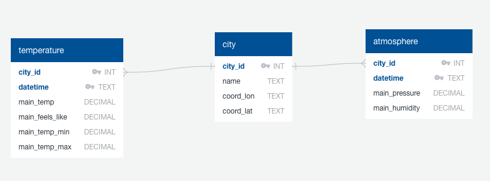
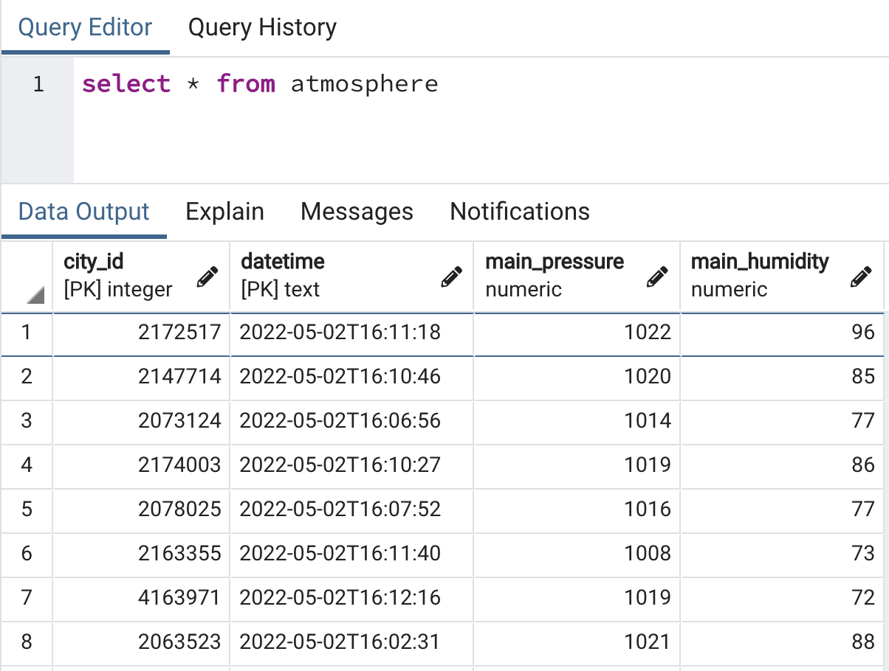

# Task 

Load your transformed dataframes into your postgres database. 

### Pre-requisites

Install the following libraries: 

```
pip install sqlalchemy
pip install pg8000
```

### Step 1: Create schema in postgres

Write Data Definition Language (DDL) SQL statements to create the following tables and relationships in your postgres database. 



Hint: 
- See [CREATE TABLE](https://www.postgresqltutorial.com/postgresql-tutorial/postgresql-create-table/)
- See [alter table to add foreign key constraints](https://kb.objectrocket.com/postgresql/alter-table-add-constraint-how-to-use-constraints-sql-621)

### Step 2: Create database connection in python

Use the following code snippet to create a connection to your database. 

```python
from sqlalchemy import create_engine
from sqlalchemy.engine import URL
from sqlalchemy.dialects import postgresql

DB_USER = os.environ.get("DB_USER")
DB_PASSWORD = os.environ.get("DB_PASSWORD")
DB_SERVER_NAME = os.environ.get("DB_SERVER_NAME")
DB_DATABASE_NAME = os.environ.get("DB_DATABASE_NAME")
connection_url = URL.create(
    drivername = "postgresql+pg8000", 
    username = DB_USER,
    password = DB_PASSWORD,
    host = DB_SERVER_NAME, 
    port = 5432,
    database = DB_DATABASE_NAME, 
)

engine = create_engine(connection_url)
```

You will first have to set environment variables before running the python script. 

```
export DB_USER="x"
export DB_PASSWORD="x"
export DB_SERVER_NAME="x"
export DB_DATABASE_NAME="x"
```

### Step 3: Reflect ORM 

We wish to perform an upsert into the postgres database. Therefore, we will first need to detect the schema. 

To detect the schema, we use the code snippet below to reflect the database schema into python objects. 

```python
## Reflect ORM
from sqlalchemy import MetaData
metadata_obj = MetaData()
metadata_obj.reflect(bind=engine)
city = metadata_obj.tables["city"]
temperature = metadata_obj.tables["temperature"]
atmosphere = metadata_obj.tables["atmosphere"]
```

### Step 4: Perform upsert

Refer to the code snippet below on how to perform an upsert into a postgres database from pandas. 

```python
## Upsert: City
insert_statement = postgresql.insert(schema_name).values(df_name.to_dict(orient='records'))
upsert_statement = insert_statement.on_conflict_do_update(
    index_elements=['primary_keys'],
    set_={c.key: c for c in insert_statement.excluded if c.key not in ['primary_keys']})
engine.execute(upsert_statement)
```
Where: 
- `schema_name` refers to `city` or `temperature` or `atmosphere` 
- `df_name` refers to `city_df` or `temperature_df` or `atmosphere_df`
- `primary_keys` refers to `city_id` or `city_id` and `datetime` 

You should see records appear in your database table. For example: 
