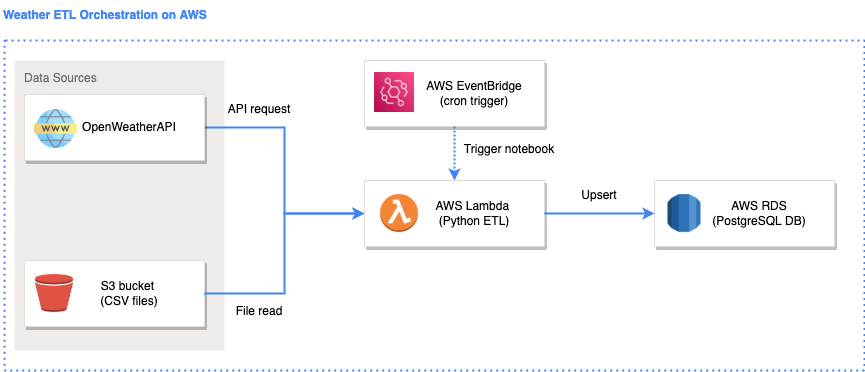

# Introduction

An introduction to ETL principles by building a simple python ETL solution hosted on AWS. 

Participants to attempt the `unsolved` folders from `01` to `06`. 

Participants may review the solution in the `solved` folder after attempting their own solution. 